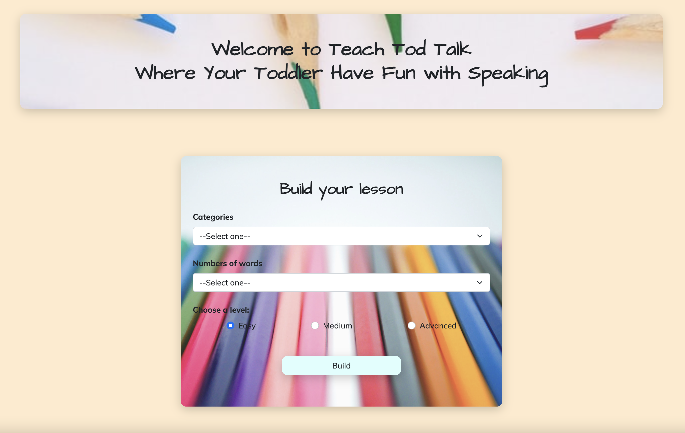

# Teach Tod Talk #
- I built this project to help teach my toddler a combination of skills. Besides learning to speak, he will get exposure to colors, and the real images of animals and fruits. When he speaks a word correctly, the background will change to the right color or will show the right animal and fruit. 
- This simple app is designed to provide quality time for parents and toddlers via communication, explanation, and demonstration. Getting the words right should not be the only priority because your child will get to that level; for now, enjoying time, seeing things, talking, making noises and laughing are all he needs.

## Technologies ##
Python, Flask, JavaScript, HTML, CSS, Bootstrap. Integrated with Web Speech API for speed recognition.

## Status ##
- Start date: Jul 26, 2022
- MVP completed: Aug 2, 2022

## Quick Demo ##
1. Homepage: On the homepage, users can customize their lesson plan for today. Choose one category from Colors, Animals and Fruits, choose the number of words and the level of difficulty to build your plan.

          
  

2. For each lesson, choose a word among the list, tap or click the mouse to start speech recognition and say the word out loud. Watch what happens when you speak the word correctly.

- Color demo:

https://user-images.githubusercontent.com/98496276/182677586-24326b84-b105-49a9-bdc7-1748fe6a5c94.mp4

- Animal demo:

https://user-images.githubusercontent.com/98496276/182677675-5fa2a9ea-8dcb-470a-8b24-b6748a71e6bc.mp4

3. If the word is not recognized, the app will let you know the reason, whether it is because it cannot pick up the sound, or the word is not in the lesson. You can encourage your child to try again or try a different word.

https://user-images.githubusercontent.com/98496276/182679311-5be39891-237a-4576-9f3a-10127d46b63b.mov

## Future updates:
- Add database for user account and data storage
- Give users the option to create word lists and add pictures to create their own lesson plan

